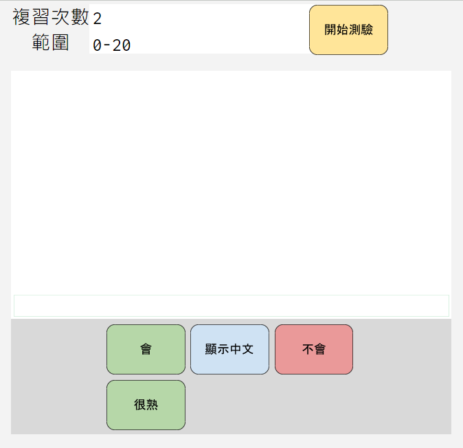
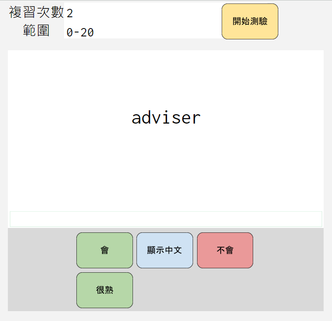
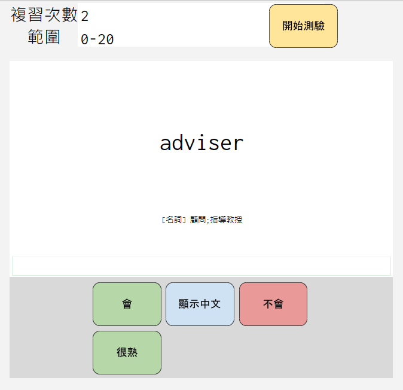
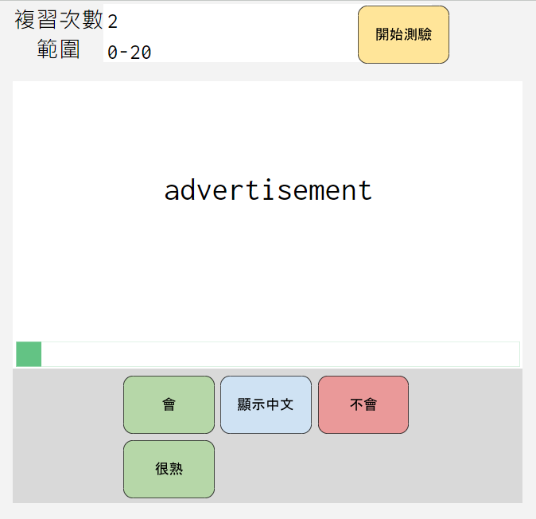
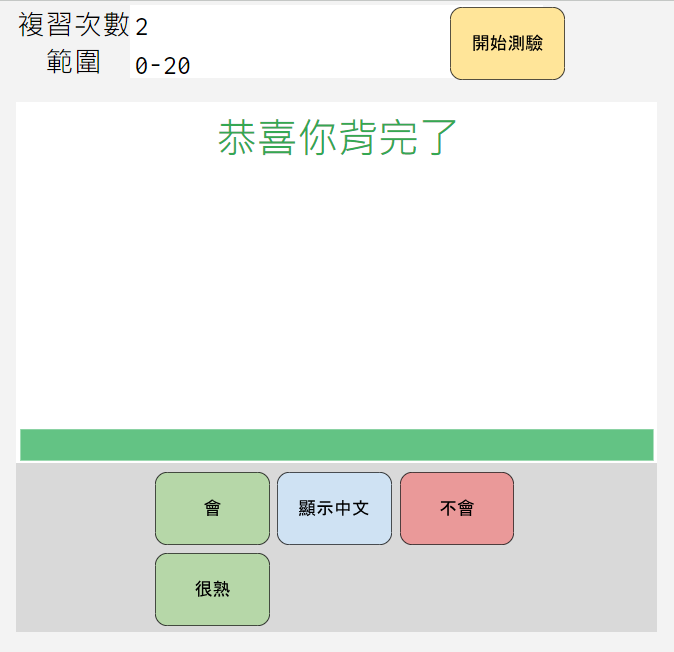
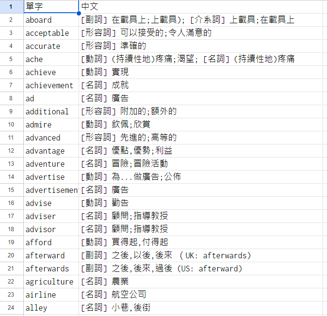

# 試算表單字卡
此專案利用Google Apps Script和Google Sheet製作簡易的單字卡，可以匯入單字以及詞意，並且可以隨機出題，藉由反覆練習來記憶單字。 v

## 專案成果
首先指定要複習的範圍和要重複出現的次數 

 
按下「開始測驗｣後，會隨機出現單字。 
想好後按「顯示中文」，會顯示單字的中文意思。 
如果答對了，按「會」，如果已經熟悉了，按「很熟」。 
如果你不會的話，按「不會」，這樣下次就會再出現這個單字。 

 
當有單字複習完之後，下面的進度條就會增加 

 
當你背完後會顯示「恭喜你背完了」 

## 匯入單字
在「單字表」工作區貼上單字的英文和中文意思即可。 

